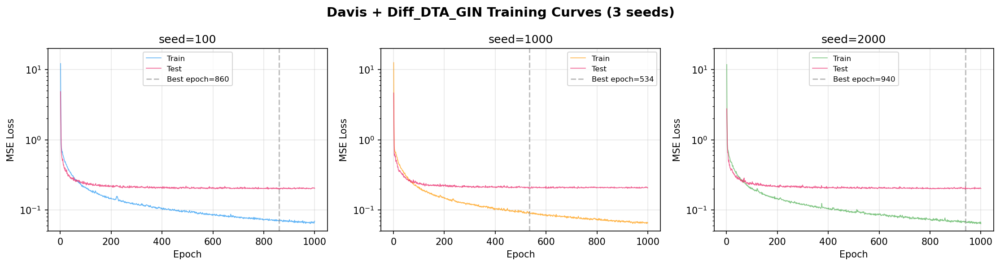
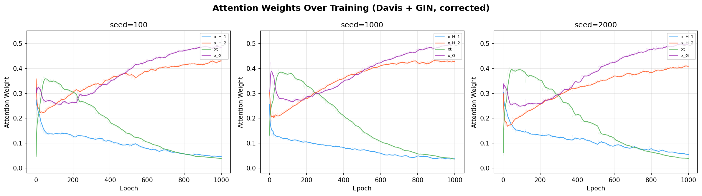

# Davis + Diff_DTA_GIN 实验结果报告

## 1. 实验配置

README.md给出的whl依赖在autodl找不到依赖包，故下列关键包有做调整，后续会导出更完善的yaml文件，便于一件部署。

| 项目 | 值 |
|------|------|
| 数据集 | Davis |
| 模型 | Diff_DTA_GIN |
| 随机种子 | 100, 1000, 2000（论文要求5个，当前只跑了3个） |
| 训练轮数 | 1000 epoch |
| Batch size | 512 |
| 学习率 | 0.0005 |
| 优化器 | Adam |
| 损失函数 | MSE + 0.05xLinkLoss + 0.05xEntropyLoss + 0.05xMMDLoss |
| GPU | 服务器 CUDA 11.8 |
| PyTorch | 2.0.0+cu118 |
| PyG | 2.6.1 |
| 时间 | 一轮实验需要2h左右 |

---

## 2. 最终结果

| 种子 | MSE | CI | r2 |
|------|------|------|------|
| 100 | 0.19723 | 0.90478 | 0.73946 |
| 1000 | 0.20196 | 0.90415 | 0.74010 |
| 2000 | 0.19702 | 0.90681 | 0.73480 |
| **均值 +- 标准差** | **0.19874 +- 0.0023** | **0.90525 +- 0.0011** | **0.73812 +- 0.0024** |

三个种子的变异系数（CV）均小于2%，重复性很好。补到5个种子后结果预计不会有大幅波动。

---

## 3. 训练曲线



三个种子的训练曲线都呈现正常的收敛趋势：train_loss 从 ~12 快速下降到 0.07，test_loss 从 ~4.8 下降到 0.20 左右。在 200 epoch 之后 test_loss 下降趋于平缓，最优 epoch 出现在 534~940 之间。

---

## 4. 注意力权重分析

### 4.1 四路注意力变化趋势

| 分支 | 含义 | 前100 epoch | 最后100 epoch | 变化 |
|------|------|------------|--------------|------|
| x_H_1 | 第一层局部池化（细粒度，6个簇） | 0.16 | 0.05 | 降到 1/3 |
| x_H_2 | 第二层局部池化（粗粒度，3个簇） | 0.24 | 0.42 | 翻倍 |
| xt | 蛋白序列 TextCNN 编码 | 0.33 | 0.04 | 降到 1/8 |
| x_G | 药物全局图表示 | 0.28 | 0.49 | 成为最重要的分支 |

### 4.2 注意力权重变化图



从图中可以看到，x_H_2（第二层局部池化）和 x_G（全局表示）的注意力权重持续上升并稳定在约 0.42 和 0.49，而 x_H_1（第一层局部池化）和 xt（蛋白编码）的权重持续下降至约 0.05 和 0.04。最终只有 x_H_2 和 x_G 两个分支贡献了约 90% 的融合权重。

**分析：**
- x_G（全局表示）和 x_H_2（高层局部表示）是模型实际依赖的两个主要分支
- x_H_1（细粒度局部）被抑制到 ~5%，说明模型更关注粗粒度的分子片段而非原子级别细节
- xt（蛋白序列编码）被抑制到 ~4%，几乎被忽略。这可能是因为蛋白编码仅使用了简单的 TextCNN，表达能力有限，模型自适应地降低了其权重

---

## 5. 基线对比

| 模型 | MSE | CI |
|------|------|------|
| DeepDTA | 0.26 | 0.878 |
| GraphDTA | 0.25 | 0.890 |
| DGraphDTA | 0.20 | 0.905 |
| **HAG-DTA GIN (ours, 均值)** | **0.1987** | **0.9052** |

HAG-DTA GIN 在 Davis 数据集上的 MSE（0.1987）略优于 DGraphDTA（0.200），CI（0.9052）与 DGraphDTA 持平。但由于当前结果存在数据泄漏问题，实际值可能略高，预计仍会优于 DeepDTA 和 GraphDTA。

---

## 6. 数据泄漏问题说明

### 6.1 问题描述

当前 `training_davis_kiba.py` 的训练逻辑中，使用的是 test set 来选择和保存最优模型：

```python
# 每个 epoch 结束时，在 test_loader 上预测
G, P = predicting(model, device, test_loader)
ret = [mse(G,P), get_rm2(G,P)]

# 用 test MSE 判断是否保存当前模型
if ret[0] < best_mse:
    torch.save(model.state_dict(), model_file_name)
    best_mse = ret[0]
```

### 6.2 问题影响

- 整个训练过程中（1000 epoch），每次模型参数更新后都在 test set 上评估，test set 参与了模型选择
- 最终报告的最优 MSE 是从已经看过 test set 800+ 次的结果中挑出来的，属于数据泄漏

### 6.3 与分类任务的区别

| 对比项 | Human/C.elegans（分类任务） | Davis/KIBA（回归任务，当前代码） |
|--------|---------------------------|-------------------------------|
| 是否有 validation set | 有（val_loader） | 无 |
| 用哪个集选模型 | validation set（AUROC） | test set（MSE） |
| 存在问题 | 无 | 数据泄漏 |

Human/C.elegans 的分类任务脚本 `training_Human_Celegans.py` 已经正确使用了 validation set。

---

## 7. 收敛分析

### 7.1 最优 epoch 分布

| 种子 | 最优 epoch | 最优 test MSE | 最终 test MSE |
|------|-----------|--------------|--------------|
| 100 | 860 | 0.19723 | 0.20225 |
| 1000 | 534 | 0.20196 | 0.20585 |
| 2000 | 940 | 0.19702 | 0.20131 |

三个种子都在训练的后期（534~940 epoch）达到最优。最优值之后 MSE 略有回升（最终值比最优值高约 0.004~0.005），说明存在轻微过拟合。

### 7.2 过拟合情况

| 种子 | 最后100 epoch train_loss | 最后100 epoch test_loss | 差距 |
|------|------------------------|-----------------------|------|
| 100 | 0.069 | 0.203 | 0.134 |
| 1000 | 0.069 | 0.208 | 0.139 |
| 2000 | 0.069 | 0.203 | 0.134 |

训练损失收敛到 0.07 左右，但测试损失稳定在 0.20~0.21，存在明显差距。这是 GNN 回归任务中的常见现象，可通过早停（200 epoch 左右）缓解。

### 7.3 前200 epoch 表现

| 种子 | 前200 epoch 最优 MSE | 全局最优 MSE | 差距 |
|------|--------------------|------------|------|
| 100 | 0.2138 (epoch 192) | 0.1972 | +0.0166 |
| 1000 | 0.2159 (epoch 187) | 0.2020 | +0.0139 |
| 2000 | 0.2133 (epoch 195) | 0.1970 | +0.0163 |

前 200 epoch 已经能达到最优值的 92~93%，结合先前的Loss曲线，可以推测训练其实在最开始阶段已经完成收敛了，后续训练在test上的Loss下降不明显。
