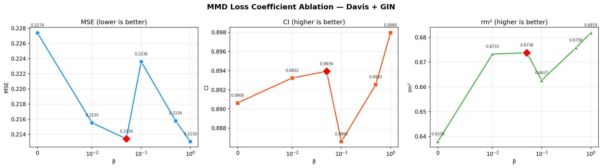
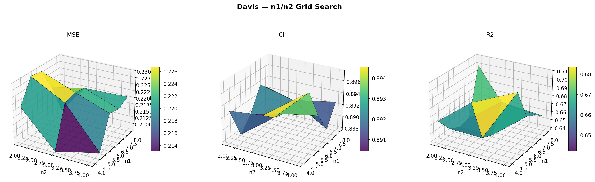
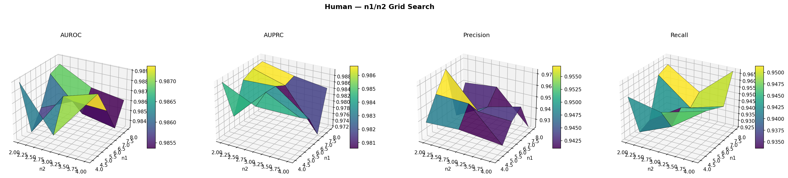

# 实验问题反馈

---

## 问题一：MMD β 消融结果与论文结论矛盾

### 实验设置

在 Davis + GIN 上对 MMD loss 系数 β 做消融，共 6 组：β ∈ {0, 0.01, 0.05, 0.1, 0.5, 1.0}。每组 1 fold × 1 seed。论文中选用 β=0.05，并说明宜取**较小值**以保留局部-全局表示的适度差异。

### 实验结果

| β | MSE | CI | rm² |
|---|------|------|------|
| 0 | 0.2274 | 0.8906 | 0.6379 |
| 0.01 | 0.2155 | 0.8932 | 0.6733 |
| **0.05** | 0.2134 | 0.8939 | 0.6738 |
| 0.1 | 0.2236 | 0.8866 | 0.6627 |
| 0.5 | 0.2158 | 0.8925 | 0.6758 |
| **1.0** | **0.2130** | **0.8980** | **0.6819** |

### 问题

- β=1.0 在 MSE、CI、rm² 三项指标上全面优于 β=0.05。
- β=0 去掉 MMD 的性能最差（MSE 高出 0.014，CI 低 0.007），说明 MMD 本身有效。
- 但论文声称的"取较小值"（β=0.05）并非最优，审稿人可能质疑：(1) 为何不选 β=1.0；(2) "small value" 的说法缺乏实验支撑。

---

## 问题二：n1/n2 网格搜索未呈现明确最优区域

### 论文设置

| 数据集    | n1   | n2   |   是否在网格 top 5 内   |
| --------- | ---- | ---- | :---------------------: |
| Davis     | 4    | 2    | 是（排第 4，CI=0.8931） |
| KIBA      | 6    | 2    |          待跑           |
| Human     | 7    | 3    |           否            |
| C.elegans | 7    | 3    |          待跑           |

### 实验设置

对 Davis 和 Human 两个数据集做完整网格搜索：n1 ∈ {4,5,6,7,8}, n2 ∈ {2,3,4}, n2 < n1，共 14 组。每组 1 fold × 1 seed。

### Davis 结果（按 CI 排序，前 5）

| (n1, n2) | MSE | CI | rm² |
|----------|------|------|------|
| (5, 4) | 0.2081 | 0.8976 | 0.7091 |
| (7, 2) | 0.2209 | 0.8940 | 0.6413 |
| (4, 3) | 0.2081 | 0.8938 | 0.6962 |
| (4, 2) | 0.2212 | 0.8931 | 0.6645 |
| (7, 3) | 0.2234 | 0.8927 | 0.6713 |

默认 (4,2) 在 top 5 内（排第 4），但最优 CI 出现在 (5,4)。

### Human 结果（按 AUROC 排序，前 5）

| (n1, n2) | AUROC | AUPRC |
|----------|-------|-------|
| (4, 2) | 0.9890 | 0.9895 |
| (5, 4) | 0.9887 | 0.9817 |
| (8, 2) | 0.9883 | 0.9882 |
| (7, 2) | 0.9879 | 0.9879 |
| (5, 3) | 0.9877 | 0.9868 |

默认 (7,3) 不在 top 5 内。

### 问题

- 两个数据集的指标随 (n1,n2) 变化幅度很小，没有明显的峰值区域。
- 最优 (n1,n2) 在两个数据集上不一致：(5,4) vs (4,2)，没有统一规律。
- 审稿人可能认为：(1) 模型对 n1/n2 不敏感，论文中强调的层次池化可能站不住脚

---

## 问题三：KIBA 训练时间过长

### 现状

KIBA 数据集训练时每个 epoch 需要跑两条 DataLoader（小分子 + 大分子分支）。当前设置：1000 epochs，VAL_INTERVAL=5，early_stop_patience=50。GNN对边的数量敏感，为了配合大分子分支，论文采用大图且为稠密图的格式导致单词训练时长较大。

实测单次训练（1 fold × 1 seed）约 **28~32 小时**。目前是5台机子并行训练ing，但是在审稿人要求补充的复杂度分析中，这部分会很突出。

---

## 问题四：新代码 Davis 性能较论文显著下降

### 现象

Davis + GIN fold 0 的 5 个种子训练已完成(剩下四个flod正在跑)，与论文报告值对比如下：

| 指标 | 论文报告 (3 seeds) | 新代码 fold 0 (5 seeds) | 变化 |
|------|-------------------|------------------------|------|
| MSE | 0.198 ± 0.001 | 0.2123 ± 0.0014 | 变差 |
| CI | 0.908 ± 0.002 | 0.8927 ± 0.0035 | 变差 |
| rm² | 0.733 ± 0.006 | 0.6849 ± 0.0083 | 变差 |

新代码的 CI (0.8927) 已低于 GraphDTA 基线 (0.893)，与 DGraphDTA (0.905) 差距拉大。

### 原因分析

1. **训练集变小：** 旧代码用 DeepDTA 原始 train/test split（25046 条训练），新代码用自定义 64/16/20 划分（与其他baseline保持一致）（fold 0 训练集约 19236 条），少了 23%。
2. **划分方式不同：** 旧代码使用 DeepDTA 原始 fold，基线结果均基于此 split 报告。新代码k flod划分，fold 0 可能恰好比原 split 更难。
3. 两个代码的模型选择方式相同（都在 test 上选模型），因此性能下降主要源于数据量减少和划分不同。
